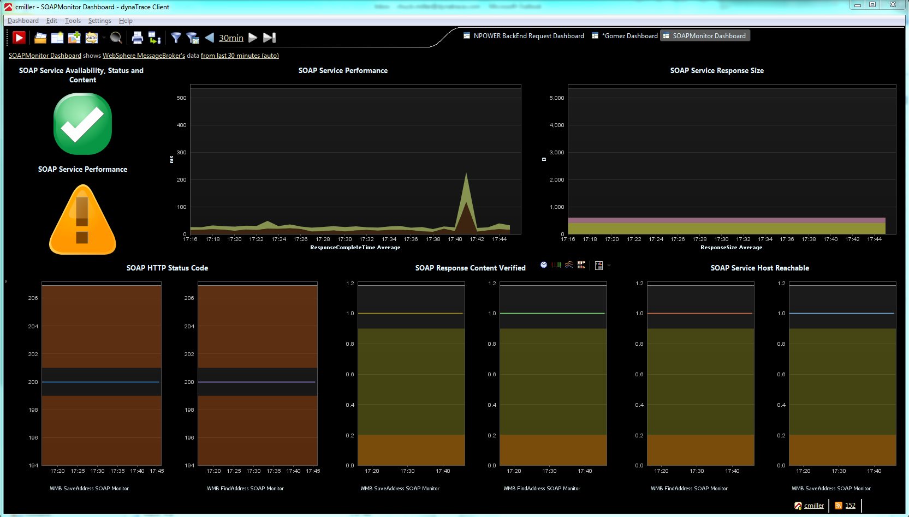

<html xmlns="http://www.w3.org/1999/xhtml">
<head>
    <title>SOAP Monitor Plugin</title>
    <meta http-equiv="Content-Type" content="text/html; charset=UTF-8"/>
    <meta http-equiv="X-UA-Compatible" content="IE=EmulateIE8" />
    <meta content="Scroll Wiki Publisher" name="generator"/>
    <link type="text/css" rel="stylesheet" href="css/blueprint/liquid.css" media="screen, projection"/>
    <link type="text/css" rel="stylesheet" href="css/blueprint/print.css" media="print"/>
   <link type="text/css" rel="stylesheet" href="css/content-style.css" media="screen, projection, print"/>
    <link type="text/css" rel="stylesheet" href="css/screen.css" media="screen, projection"/>
    <link type="text/css" rel="stylesheet" href="css/print.css" media="print"/>
</head>
<body>
                <h1>SOAP Monitor Plugin</h1>
    

        <table>
<thead class=" "></thead><tfoot class=" "></tfoot><tbody class=" ">    <tr>
            <td rowspan="1" colspan="1">
        

Name    

            </td>
                <td rowspan="1" colspan="1">
        

<strong class=" ">SOAP Monitor Plugin</strong>    

            </td>
        </tr>
    <tr>
            <td rowspan="1" colspan="1">
        

Description    

            </td>
                <td rowspan="1" colspan="1">
        

The SOAP Monitor verifies availability, content, and access time for specified SOAP requests to ensure the availability of SOAP Services. It supports secure communication and HTTP proxies.    

            </td>
        </tr>
    <tr>
            <td rowspan="1" colspan="1">
        

Plug-In Version    

            </td>
                <td rowspan="1" colspan="1">
        

1.0    

            </td>
        </tr>
    <tr>
            <td rowspan="1" colspan="1">
        

Compatible with    

            </td>
                <td rowspan="1" colspan="1">
        

dynaTrace 4    

            </td>
        </tr>
    <tr>
            <td rowspan="1" colspan="1">
        

Author    

            </td>
                <td rowspan="1" colspan="1">
        

Chuck Miller (<a href="mailto:chuck.miller@dynatrace.com">chuck.miller@dynatrace.com</a>)    

            </td>
        </tr>
    <tr>
            <td rowspan="1" colspan="1">
        

License    

            </td>
                <td rowspan="1" colspan="1">
        

<a href="attachments_5275722_2_dynaTraceBSD.txt">dynaTrace BSD</a>    

            </td>
        </tr>
    <tr>
            <td rowspan="1" colspan="1">
        

Support    

            </td>
                <td rowspan="1" colspan="1">
        

<a href="https://community/display/DL/Support+Levels#SupportLevels-Community">Not Supported </a>    

            </td>
        </tr>
    <tr>
            <td rowspan="1" colspan="1">
        

Downloads    

            </td>
                <td rowspan="1" colspan="1">
        

<a href="attachments_62160901_1_com.dynatrace.diagnostics.plugin.SOAPMonitor_4.0.0.2599.jar">SOAP Monitor Plugin</a> <a href="attachments_62160904_1_WebSphere_MessageBroker.profile.xml">Sample System Profile</a> <a href="attachments_62160905_1_SOAPMonitor_Dashboard.dashboard.xml">Sample Dashboard</a>    

            </td>
        </tr>
    <tr>
            <td rowspan="1" colspan="1">
        

Technical overview    

            </td>
                <td rowspan="1" colspan="1">
        

This monitor plugin provides the following measures:    

<ul class=" "><li class=" ">    

ConnectionCloseDelay    

</li><li class=" ">    

ContentVerified    

</li><li class=" ">    

FirstResponseDelay    

</li><li class=" ">    

HeaderSize    

</li><li class=" ">    

HostReachable    

</li><li class=" ">    

HttpStatusCode    

</li><li class=" ">    

ResponseCompleteTime    

</li><li class=" ">    

ResponseSize    

</li><li class=" ">    

Throughput    

</li></ul>            </td>
        </tr>
    <tr>
            <td rowspan="1" colspan="1">
        

Install Description    

            </td>
                <td rowspan="1" colspan="1">
        

Import the Plugin into the dynaTrace Server. For details how to do this please refer to the <a href="https://community/display/DOCDT40/Plugin+Management">dynaTrace  documentation</a>.    

            </td>
        </tr>
    <tr>
            <td rowspan="1" colspan="1">
        

Configuration    

            </td>
                <td rowspan="1" colspan="1">
        

The SOAP Monitor is derived from the <a href="https://community/display/DOCDT40/URL+Monitor">URL Monitor</a> and requires similar configuration information such as protocol, port, path, and host(s) to monitor. In addition, authorization credentials and proxy information can be specified.  Furthermore, SOAP envelope data to be sent with a POST request has to be specified. As an example, we provide a sample <a href="attachments_62160904_1_WebSphere_MessageBroker.profile.xml">system profile</a> and a <a href="attachments_62160905_1_SOAPMonitor_Dashboard.dashboard.xml">dashboard</a> configured to monitor WebSphere Message Broker.    

            </td>
        </tr>
    <tr>
            <td rowspan="1" colspan="1">
        

Screenshots    

            </td>
                <td rowspan="1" colspan="1">
        

Showing a dashboard with some of the monitor's measures and the configuration dialogs:    

    

        <table>
<thead class=" "></thead><tfoot class=" "></tfoot><tbody class=" ">    <tr>
            <td rowspan="1" colspan="1">
        

            
            

            </td>
        </tr>
    <tr>
            <td rowspan="1" colspan="1">
                </td>
        </tr>
</tbody>        </table>
            

            </td>
        </tr>
    <tr>
            <td rowspan="1" colspan="1">
        

Known Problems    

            </td>
                <td rowspan="1" colspan="1">
        

    

            </td>
        </tr>
</tbody>        </table>
            

            

        

        

        

    

</body>
</html>
